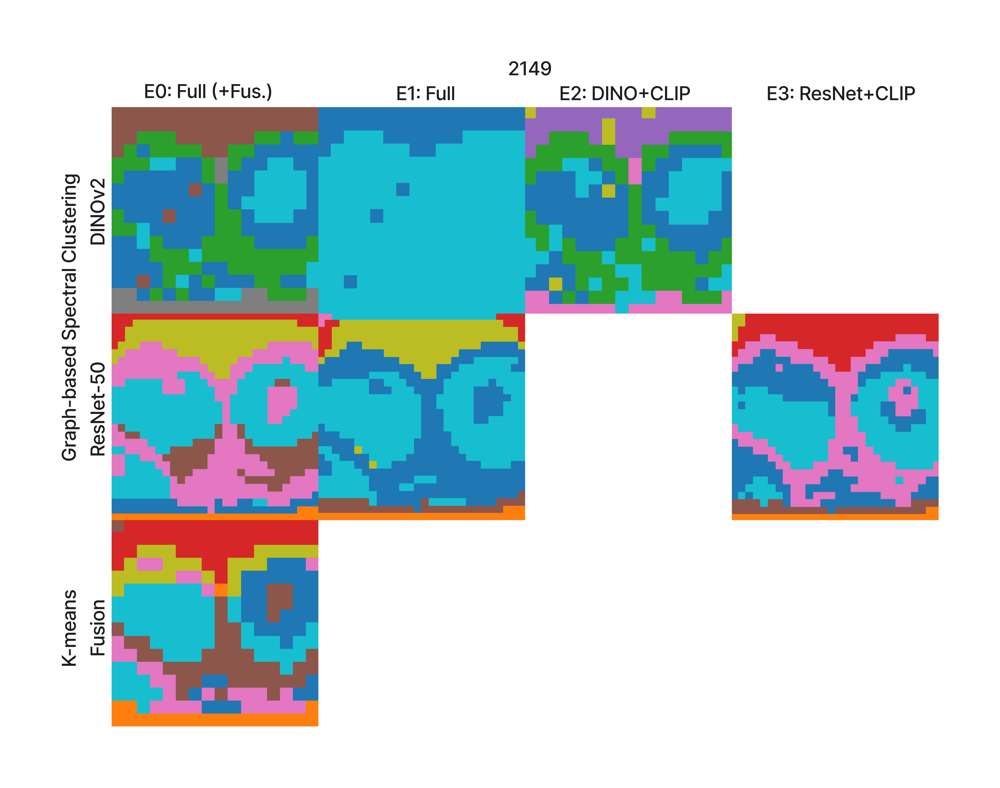
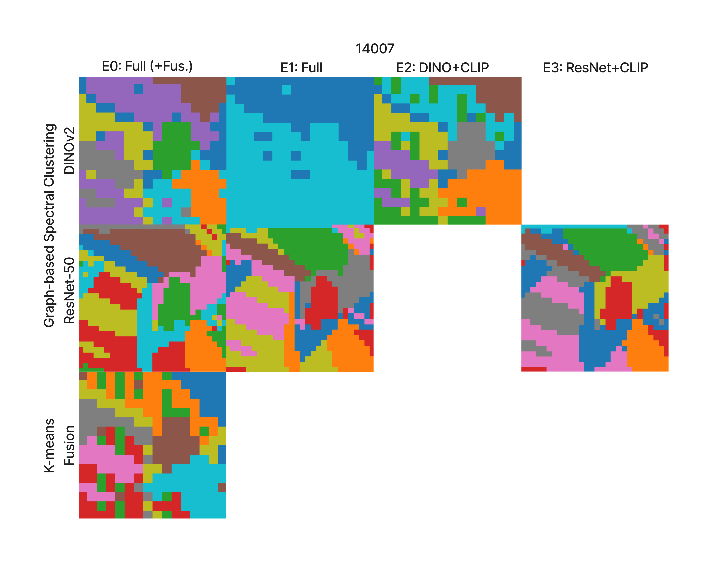
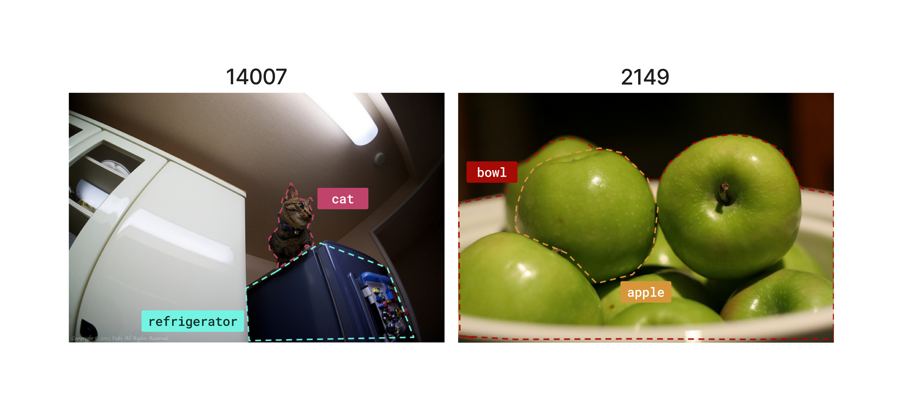
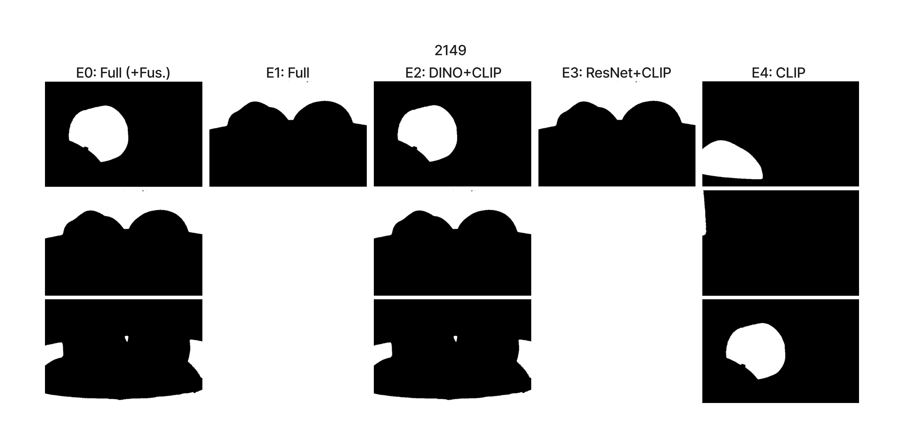
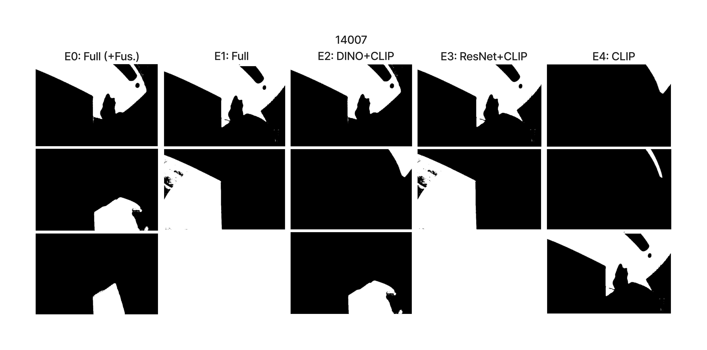

<h1 align="center">HybridVision</h1>
<p align="center">
  <i>Multimodal Image Segmentation via Deep Representations and Unsupervised Clustering</i>
</p>
<p align="center">
  <a href="https://hybridvision.streamlit.app/">Dashboard</a> ·
  <a href="https://zenodo.org/records/19394225">Zenodo</a> ·
  <a href="https://arxiv.org/abs/XXXX.XXXXX">arXiv</a> ·
  <a href="LINK_LUME_AQUI">UFRGS Monograph [PT-BR]</a>
</p>
<br>
<p align="center">
  
</p>

## Overview

HybridVision is an experimental modular pipeline for unsupervised image segmentation.
It integrates multiple pre-trained components into a modular pipeline to study how segmentation emerges from their interaction.

The system combines:
- Region proposals via SAM2
- Deep representations from DINOv2 and ResNet-50
- Multimodal alignment using CLIP
- Unsupervised clustering (K-Means, Graph Spectral methods)
- Cross-modal validation mechanisms

## Project Structure

```text
  ├── configs/                  # pipeline and experiment configurations
  ├── dashboard/                # Streamlit dashboard
  ├── datasets/                 # input images and auxiliary data
  ├── docs/                     # Streamlit files, figures, and README assets
  ├── experiments/              # experiment outputs and analysis artifacts
  ├── scripts/                  # utility and execution scripts
  ├── src/
  │   ├── analyzers/
  │   │   ├── __init__.py
  │   │   ├── experiment_analyzer.py
  │   │   ├── performance_analyzer.py
  │   │   └── tuning_analyzer.py
  │   ├── clusterers/
  │   │   ├── __init__.py
  │   │   ├── base_clusterer.py
  │   │   ├── graph_clusterer.py
  │   │   ├── kmeans_clusterer.py
  │   │   ├── spectral_clusterer.py
  │   │   └── utils_clusterer.py
  │   ├── estimators/
  │   │   ├── __init__.py
  │   │   └── cluster_count_estimator.py
  │   ├── extractors/
  │   │   ├── __init__.py
  │   │   ├── base_extractor.py
  │   │   ├── clip_extractor.py
  │   │   ├── dino_v2_extractor.py
  │   │   └── resnet_extractor.py
  │   ├── labelers/
  │   │   ├── __init__.py
  │   │   ├── clip_labeler.py
  │   ├── normalizers/
  │   │   ├── __init__.py
  │   │   └── feature_normalizer.py
  │   ├── optimizers/
  │   │   ├── __init__.py
  │   │   └── k_optimizer.py
  │   ├── postprocessors/
  │   │   ├── __init__.py
  │   │   └── identify_resolver.py
  │   ├── preprocessors/
  │   │   ├── __init__.py
  │   │   └── preprocessor.py
  │   ├── reducers/
  │   │   ├── __init__.py
  │   │   └── dimensionality_reducer.py
  │   ├── utils/              
  │   │   ├── __init__.py
  │   │   ├── experiment_logger.py
  │   │   ├── image_loader.py
  │   │   ├── io.py
  │   │   └── visualizer.py
  │   ├── validators/           
  │   │   ├── __init__.py
  │   │   └── final_validator.py
  │   ├── wrappers/             
  │   │   ├── __init__.py
  │   │   └── sam2_wrapper.py
  │   ├── __init__.py
  │   ├── run.py
  │   └── pipeline.py           
  ├── pipeline_walkthrough.ipynb
  └── requirements.txt
```

## Installation

This project requires the following setup due to the use of multiple pre-trained models and configurable pipelines.

### 1. Clone repository
```
git clone https://github.com/murillomasson/hybridVision
cd hybridVision
```

### 2. Create environment

Recommended (conda):
```
conda create -n hybridvision python=3.10
conda activate hybridvision
```

or with venv:
```
python -m venv venv
source venv/bin/activate  # linux/mac
venv\Scripts\activate   # windows
```
### 3. Install dependencies
```
pip install -r requirements.txt
```
### 4. Model dependencies

The pipeline relies on multiple pre-trained models:

- DINOv2 (feature extraction)
- ResNet-50 (feature extraction)
- CLIP (labeling and semantic alignment)
- SAM / SAM2 (region proposals)

These models are automatically loaded via their respective modules, but may require:

- GPU support (recommended)
- Initial download of weights

### 5. Configuration

The pipeline is fully driven by configuration files.

Before running, you must define:

- which pipelines to activate (DINO / ResNet / Fusion)
- clustering method and parameters
- k-selection strategy
- validation weights
- input image directory

Example:
`configs/default.yaml`
### 6. Input data

Place your images in a directory and update:

```image_dir: path/to/images```

The pipeline processes images individually and generates:
- cluster maps
- visualizations
- validated masks
- final segmentation outputs

### 7. Running the pipeline
```
python main.py --config configs/default.yaml
```

## Pipeline Configuration Notes

The system is modular and execution depends heavily on configuration.

Key toggles:

```run_dino_pipeline: true```
```run_resnet_pipeline: true```
```run_fusion_pipeline: true```

Each branch activates:

- feature extraction
- clustering
- optional CLIP labeling


### _Important Considerations_

- GPU is strongly recommended
- First run may take longer due to model loading
- Memory usage can be high depending on configuration
- Intermediate results are cached to improve subsequent runs


### _Walkthrough_

For a step-by-step execution example, refer to:

```pipeline_walkthrough.ipynb```

This notebook demonstrates:

- how the pipeline is executed
- intermediate outputs
- clustering behavior across representations
- validation process

## Experimental Analysis
### Representation Spaces

Different models induce different structures in feature space.
<p align="center">
  <picture>
    <source media="(prefers-color-scheme: dark)" srcset="docs/heatmaps_2149_dark.png">
    
  </picture>

  <picture>
    <source media="(prefers-color-scheme: dark)" srcset="docs/heatmaps_14007_dark.png">
    
  </picture>
</p>

Observations:
- DINOv2 and ResNet-50 produce distinct visual representations
- These representations result in different clustering organizations in the image space
- The fused representation introduces an additional configuration

### Segmentation Results
Final segmentation is obtained through agreement between multiple signals.
It is selected through agreement between multiple signals.

<p align="center">
  <picture>
    <source media="(prefers-color-scheme: dark)" srcset="docs/images_sample_dark.png">
    
  </picture>
</p>

### Validated Masks

Validation combines semantic and spatial signals:

<p align="center">
  <picture>
    <source media="(prefers-color-scheme: dark)" srcset="docs/masks_2149_dark.png">
    
  </picture>

  <picture>
    <source media="(prefers-color-scheme: dark)" srcset="docs/masks_14007_dark.png">
    
  </picture>
</p>

Each region is evaluated using:
- CLIP confidence
- IoU with DINO clusters
- IoU with ResNet clusters

Final score:

    Final Score = w1 * CLIP + w2 * IoU_DINO + w3 * IoU_RESNET


### Experimental Configurations
- E0: Full pipeline with fusion
- E1: Full pipeline
- E2: DINO + CLIP
- E3: ResNet + CLIP
- E4: CLIP only

## Key Insights

- The choice of the number of clusters (k) directly affects segmentation granularity, influencing both over-segmentation and region merging
- The clustering step does not have an intrinsic notion of semantic correctness, and its outcomes are shaped by both representation and hyperparameter choices
- CLIP-based signals provide semantic association but lack spatial structure when used in isolation
- The integration of multiple signals (CLIP, DINOv2, ResNet) introduces agreement constraints that modify the set of validated regions
- The final segmentation can be interpreted as the result of consistency across different representation spaces rather than the output of a single model

## Limitations

- The system is experimental and designed for qualitative analysis rather than optimized performance
- Results are sensitive to configuration choices, particularly clustering parameters and validation weights
- The selection of _k_ remains an external design choice, not determined intrinsically by the model
- The pipeline does not guarantee semantic correctness of regions or labels
- Experiments are limited in scale and do not aim to establish generalizable quantitative conclusions

## Future Work

- Replace heuristic validation with learned fusion mechanisms that integrate signals in a data-driven manner
- Explore graph-based modeling of relationships between regions and clusters
- Investigate more robust strategies for automatic estimation of the number of clusters
- Extend the evaluation to quantitative benchmarks and larger datasets
- Analyze the behavior of the pipeline under different representation models and configurations


## Author

Murillo Masson
